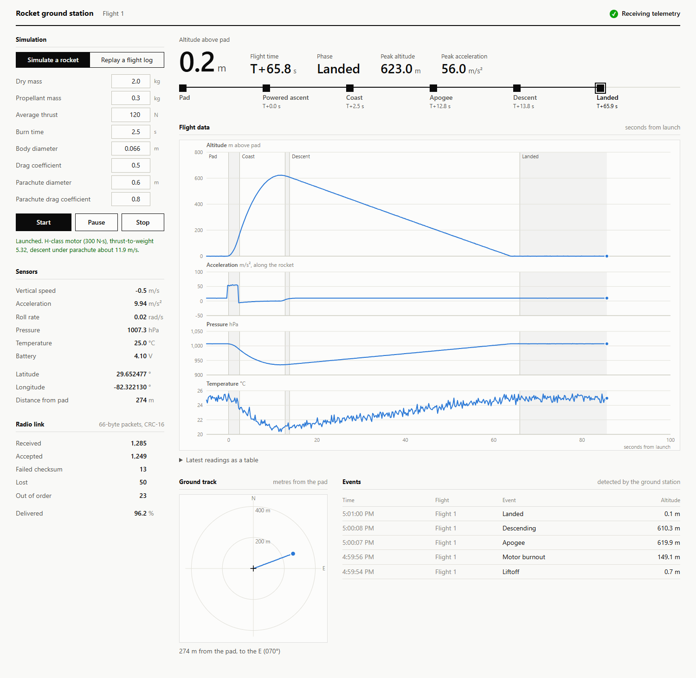

# Rocket Telemetry Dashboard

[](https://github.com/Gleeson-Daniel/rocket-telemetry-dashboard/actions/workflows/ci.yml)

A simulated rocket flight computer and the ground station that listens to it.

A C++ program plays the part of the rocket. You give it a rocket (mass, motor, drag, parachute) from the dashboard and press Start; it simulates the flight and sends its sensor readings as 66-byte binary packets over UDP, as if over a radio link. A Python ground station receives the packets, throws away any that are corrupted or arrive out of order, works out which phase of flight the rocket is in, and stores every reading in SQLite. A React dashboard shows it all live.

You can also upload a flight log as a CSV file and have it replayed through the same checks and the same phase detector.



## What it does

- **Simulates a rocket you describe.** Enter the dry mass, propellant mass, thrust, burn time, diameter, drag coefficient and parachute size, and the transmitter flies that rocket with thrust, drag, thinning air and a parachute descent.
- **Replays real flight logs.** Upload a CSV with time and altitude columns (acceleration is optional) and watch it play back with phase detection.
- **Binary telemetry protocol.** The transmitter sends fixed-size binary packets, not JSON. Each packet has a sync word, a sequence number, a timestamp, 13 sensor channels and a CRC-16. Launch, pause, resume and reset commands travel the other way in the same style.
- **Packet validation.** The ground station checks the length, sync word, CRC and protocol version of every packet, and uses the sequence number to reject duplicates and late arrivals and to count how many packets were lost.
- **Flight phase detection.** A state machine follows the rocket from the pad through powered ascent, coast, apogee and descent to landing, using acceleration and altitude. It is built so that one bad sensor reading cannot change the phase.
- **Start, pause, resume, stop.** One set of controls runs whichever you chose, a simulated rocket or a replayed log, and can freeze it mid-flight and carry on from the same instant.
- **Live dashboard.** Altitude, flight time and phase up top; altitude, acceleration, pressure and temperature plotted against time since launch with the flight phases marked; a ground track from GPS; an event log; sensor readouts; and radio link statistics. It updates 10 times a second and follows your system's light or dark setting.
- **History.** Every accepted reading and every phase transition is saved to SQLite, and the dashboard backfills the last five minutes when it loads.
- **Tests and CI.** pytest covers the packet parser, the sequence tracking, the phase detector, the log reader and the API, and drives the real C++ transmitter over UDP. GitHub Actions runs the tests and builds the Docker images on every push.

## How it fits together

```
┌──────────────────┐  telemetry packets  ┌──────────────────────┐  JSON over      ┌──────────────────┐
│ transmitter      │  UDP :9000          │ backend (FastAPI)    │  WebSocket      │ frontend (React) │
│ (C++)            │ ──────────────────▶ │                      │ ──────────────▶ │                  │
│                  │                     │ decode + CRC check   │                 │ status tiles     │
│ flight simulator │  launch / reset     │ sequence check       │  REST           │ rocket form      │
│ packet encoder   │  commands           │ phase detector       │ ◀────────────── │ log upload       │
│ fault injection  │ ◀────────────────── │ log replay           │  (launch,       │ flight phase     │
│                  │                     │ SQLite               │   replay,       │ charts           │
└──────────────────┘                     └──────────────────────┘   history)      └──────────────────┘
```

| Folder | What is in it |
| --- | --- |
| [transmitter/](transmitter/) | The C++ flight computer: `flight_sim.cpp` (flight physics and sensor noise), `packet.cpp` (telemetry encoder and CRC), `command.cpp` (command decoder), `main.cpp` (UDP link and fault injection). |
| [backend/](backend/) | The Python ground station: `protocol.py` (decoder, CRC, sequence tracking), `phase_detector.py` (state machine), `pipeline.py` (ties those together), `commands.py` (rocket specs and command encoder), `replay.py` (CSV log reader), `main.py` (UDP listener, WebSocket, REST), `database.py` (SQLite). |
| [frontend/](frontend/) | The React 19 + TypeScript dashboard. The `useTelemetry` hook loads history, holds the WebSocket open and reconnects if it drops. The charts are hand-written SVG (`StripChart.tsx`), with no charting library. |
| [samples/](samples/) | A sample flight log to try the replay with. |
| [.github/workflows/](.github/workflows/) | The CI pipeline. |

## Running it

### With Docker (easiest)

You need [Docker Desktop](https://www.docker.com/) installed and running.

```bash
docker-compose up --build
```

Then open [http://localhost:5173](http://localhost:5173). Press `Ctrl+C` in the terminal to stop everything.

This starts three containers: the transmitter, the backend and the frontend. The transmitter is started with about 1% of packets corrupted, dropped or reordered, so the link statistics have something to show.

### Without Docker

You need Python 3.11+, Node.js 20.19+ and a C++17 compiler with CMake. Use three terminals, started in this order.

**Terminal 1: backend**

```bash
cd backend
python -m venv venv
venv\Scripts\activate          # macOS/Linux: source venv/bin/activate
pip install -r requirements.txt
uvicorn main:app --port 8000
```

Wait for the line `listening for telemetry on udp://0.0.0.0:9000`.

**Terminal 2: transmitter**

```bash
cmake -S transmitter -B transmitter/build
cmake --build transmitter/build
transmitter/build/transmitter
```

On Windows with MinGW, add `-G Ninja` (or `-G "MinGW Makefiles"`) to the first command, and run `transmitter\build\transmitter.exe`. Stop the transmitter before rebuilding it; Windows will not overwrite a program that is running.

**Terminal 3: frontend**

```bash
cd frontend
npm install
npm run dev
```

Then open [http://localhost:5173](http://localhost:5173).

## Using the dashboard

When everything is running, the rocket is sitting on the pad: altitude about 0 m, phase Pad, and the charts scroll the last 60 seconds. The status at the top right reads **Receiving telemetry**. Nothing else happens until you start something.

The **Simulation** panel on the left has two tabs, for the two things you can run, and one set of buttons that works for both:

| Button | What it does |
| --- | --- |
| **Start** | Launches the rocket described in the form, or starts replaying the chosen log. Pressing it during a flight abandons that flight and starts a new one |
| **Pause** | Freezes the flight where it is. The button changes to **Resume**, which carries on from the same instant with nothing skipped |
| **Stop** | Ends the flight and puts the rocket back on the pad, or ends the replay and returns to live telemetry |

### Simulating a rocket

On the **Simulate a rocket** tab, fill in the form and press **Start**. The defaults describe a 2.3 kg rocket on an H-class motor.

| Field | Default | Meaning |
| --- | --- | --- |
| Dry mass | 2.0 kg | The rocket without propellant |
| Propellant mass | 0.3 kg | Burned off evenly during the burn |
| Average thrust | 120 N | Motor thrust, taken as constant |
| Burn time | 2.5 s | How long the motor burns |
| Body diameter | 0.066 m | Sets the frontal area for drag |
| Drag coefficient | 0.5 | Of the rocket body on the way up |
| Parachute diameter | 0.6 m | Opens at apogee |
| Parachute drag coefficient | 0.8 | |

Under the buttons you get quick estimates: the motor's total impulse and class letter, the thrust-to-weight ratio, and the descent speed under the parachute. The flight then plays out live. With the defaults:

| Flight time | What happens | What you see |
| --- | --- | --- |
| T+0 to T+2.5 s | Motor burns | Acceleration jumps to about 55 m/s², phase changes to Powered ascent |
| T+2.5 to T+13 s | Coasting upwards | Acceleration drops below zero as drag slows the rocket, phase is Coast |
| about T+13 s | Top of the flight, around 620 m | Phase passes through Apogee to Descent |
| T+13 to T+66 s | Falling under the parachute at about 12 m/s | Altitude falls steadily, pressure and temperature rise, the ground track drifts downwind |
| T+66 s onwards | On the ground | Phase is Landed, and stays there until you start again |

Change a number and start again to compare: the top of the page shows flight time, peak altitude and peak acceleration for each flight. Doubling the dry mass, for example, takes the peak from about 620 m to about 230 m.

A start is refused, with an explanation, if the thrust is not more than the rocket's weight, or if the parachute is so large that the descent would be slower than 4 m/s (the landing detector would mistake that for being on the ground).

The model is one-dimensional: the rocket goes straight up and comes straight down. It includes thrust, mass loss as propellant burns, drag that grows with the square of speed, and air that thins with altitude. It does not model wind on the ascent, tilt, or a real motor's thrust curve.

### Replaying a flight log

On the **Replay a flight log** tab, choose a CSV file, pick a playback speed and press **Start**. Try [samples/sample_flight.csv](samples/sample_flight.csv) first. While a log is replaying, the status at the top right reads Replaying, live telemetry is ignored, and the panel shows how much has played. When the log ends the dashboard goes back to live telemetry.

The file needs a header row naming its columns, then one row per sample:

```csv
time_s,altitude_m,accel_z_ms2
0.0,0.69,9.730
0.1,-0.62,9.709
```

| Column | Required | Accepted names (case and punctuation are ignored) |
| --- | --- | --- |
| Time in seconds | yes | `time`, `t`, `timestamp`, `time_s`, `seconds`; `time_ms` for milliseconds |
| Altitude in metres | yes | `altitude`, `alt`, `height`, `altitude_m`; `altitude_ft` for feet |
| Acceleration in m/s² | no | `accel`, `acceleration`, `accel_z`, `accel_z_ms2`; `accel_g` for g |
| Pressure in hPa | no | `pressure`, `pressure_hpa`; `pressure_pa` for pascals |
| Temperature in °C | no | `temperature`, `temp`, `temperature_c` |
| Battery in volts | no | `battery`, `voltage`, `battery_v` |
| Latitude, longitude | no | `lat`, `latitude`, `gps_lat`, `lon`, `longitude`, `gps_lon` |

What the reader does with the file:

- **Resamples to 10 Hz.** Logs recorded faster or slower are interpolated onto a 10 Hz grid, which is the rate the phase detector expects.
- **Zeroes the altitude.** Altitude is measured from the first second of the log, so a log in height above sea level works.
- **Works out acceleration if it is missing.** With only time and altitude, acceleration is calculated from how the altitude changes. This is rougher than a real accelerometer, but enough to find launch and burnout.
- **Adds gravity back if needed.** A real accelerometer reads +9.81 m/s² at rest. If the log reads about zero at rest, gravity is added back.
- **Leaves missing channels blank.** A channel the log does not have shows as `–` on the dashboard and "Not recorded in this log" on its chart; no value is invented for it.

Lines starting with `#` are ignored, semicolons and tabs work as separators, and rows that cannot be read are skipped. The log must start on the pad, cover between 2 seconds and 30 minutes, and be under 5 MB.

### Reading the page

- **Status** (top right) says what the page is showing: Receiving telemetry, Replaying, Paused, No signal from the transmitter (the backend is up but no packets are arriving, so check the transmitter), or Backend offline (the page reconnects by itself once the backend is back).
- **Headline** shows the current altitude, the flight time, the phase, and the flight's peak altitude and peak acceleration. Below it, the phase line fills in as the flight progresses, with the time each phase began.
- **Flight data** plots altitude, acceleration, pressure and temperature against seconds from launch. The shaded bands are the flight phases. Move the pointer over the charts, or click them and use the left and right arrow keys, to read every value at that moment; the ground track marks where the rocket was at the same time. "Latest readings as a table" under the charts gives the same numbers as text.
- **Ground track** is the view from above: the pad is the cross in the middle, and the line is where GPS says the rocket went.
- **Events** lists each phase change the ground station detected, with the time and altitude.
- **Sensors** lists every current reading. A low battery (below 3.7 V) is flagged.
- **Radio link** counts packets received, accepted, failed checksum, lost and out of order.

### Transmitter options

The transmitter can damage its own packets so you can watch the ground station cope. Each fault option is a probability per packet:

```bash
transmitter/build/transmitter --corrupt 0.05 --drop 0.05 --reorder 0.05
```

| Option | Default | Meaning |
| --- | --- | --- |
| `--host HOST` | `127.0.0.1` | Where the ground station is |
| `--port PORT` | `9000` | Its UDP port |
| `--rate HZ` | `10` | Packets per second of flight time |
| `--speedup N` | `1` | Run the flight N times faster than real time. 6× works; at 20× the ground station falls behind |
| `--autolaunch` | off | Fly the default rocket on a loop without waiting for a launch command |
| `--count N` | run forever | Stop after N packets |
| `--seed N` | random | Makes the noise and faults repeatable |
| `--corrupt P` | `0` | Chance of flipping one bit in a packet |
| `--drop P` | `0` | Chance of not sending a packet |
| `--reorder P` | `0` | Chance of sending a packet after the next one |
| `--dump FILE` | off | Write packets to a file as fast as possible, without sending them |

With Docker, change these in the `command:` line of the `transmitter` service in [docker-compose.yml](docker-compose.yml).

## The packet formats

### Telemetry (rocket to ground)

Every packet is exactly 66 bytes, little-endian, with no padding.

| Offset | Size | Type | Field |
| --- | --- | --- | --- |
| 0 | 2 | u16 | Sync word, `0xA55A` |
| 2 | 1 | u8 | Protocol version |
| 3 | 1 | u8 | Flight id |
| 4 | 4 | u32 | Sequence number |
| 8 | 8 | u64 | Timestamp, ms since the Unix epoch |
| 16 | 12 | 3 × f32 | Accelerometer x, y, z in m/s² |
| 28 | 12 | 3 × f32 | Gyroscope x, y, z in rad/s |
| 40 | 4 | f32 | Pressure in hPa |
| 44 | 4 | f32 | Altitude above the pad in m |
| 48 | 4 | i32 | Latitude in degrees × 10⁷ |
| 52 | 4 | i32 | Longitude in degrees × 10⁷ |
| 56 | 4 | f32 | Temperature in °C |
| 60 | 4 | f32 | Battery in V |
| 64 | 2 | u16 | CRC-16/CCITT-FALSE over bytes 0–63 |

Some choices worth knowing about:

- **Why binary.** The same reading as JSON is about 330 bytes; the packet is 66. On a slow radio link that is five times as many readings per second, or the same readings with far less time on air.
- **Field-by-field encoding.** The C++ encoder writes each field a byte at a time instead of copying a struct, so the result does not depend on the compiler's padding or the CPU's byte order.
- **GPS as scaled integers.** A 32-bit float can only resolve about 20 cm of latitude and 70 cm of longitude at the launch site, so both are sent as integers of degrees × 10⁷ (about 1 cm).
- **Accelerometer convention.** The Z axis reports specific force, as a real accelerometer does: +9.81 m/s² at rest, about zero in free fall.
- **Sequence numbers.** A packet with a sequence number at or below the newest one is discarded. If the number falls more than 50 behind, the ground station assumes the transmitter restarted and resynchronises.
- **Flight id.** Each launch or reset gets a new flight id, which tells the ground station to start phase detection again from the pad. Id 0 is reserved for replayed logs.

### Commands (ground to rocket)

Commands are 38 bytes, little-endian, protected by the same CRC. The transmitter listens for them on the socket it sends telemetry from, so the ground station replies to wherever telemetry last came from. A command that fails its CRC is ignored.

| Offset | Size | Type | Field |
| --- | --- | --- | --- |
| 0 | 2 | u16 | Sync word, `0xC33C` |
| 2 | 1 | u8 | Protocol version |
| 3 | 1 | u8 | Command: 1 = launch, 2 = reset to pad, 3 = pause, 4 = resume |
| 4 | 32 | 8 × f32 | Dry mass, propellant mass, thrust, burn time, diameter, drag coefficient, parachute diameter, parachute drag coefficient |
| 36 | 2 | u16 | CRC-16/CCITT-FALSE over bytes 0–35 |

Commands are sent once and not acknowledged. The new flight id appearing in the telemetry is the confirmation of a launch or reset. A paused transmitter sends nothing, and resumes with the next sequence number and the next 100 ms of flight time. If telemetry keeps arriving after a pause was sent, the ground station concludes the command was lost and stops reporting itself as paused.

## How flight phases are detected

| From | To | Condition |
| --- | --- | --- |
| Pad | Powered Ascent | Z acceleration above 20 m/s² for 3 readings in a row |
| Powered Ascent | Coast | Z acceleration below 5 m/s² for 3 readings in a row |
| Coast | Apogee | Altitude more than 2 m below its peak for 3 readings in a row |
| Apogee | Descent | Altitude more than 10 m below its peak for 3 readings in a row |
| Descent | Landed | Altitude changing by less than 3 m per second for 10 readings in a row |

Two things make this tolerant of noise. Altitude is smoothed with a median over the last five readings, which removes a single wild value completely, where an average would only dilute it. And every transition needs its condition to hold for several readings in a row, so one reading across a threshold is never enough.

If the ground station starts while the rocket is already in the air, it never sees the launch. In that case it moves from Pad straight to Coast once the altitude is clearly above 30 m, and carries on from there.

## Tests

```bash
cd backend
pip install -r requirements.txt -r requirements-dev.txt
pytest
```

The tests cover:

- **Packet parser:** the CRC against its published check value, round-tripping every field, wrong lengths, wrong sync word, wrong version, and every one of the 528 possible single-bit errors in a packet.
- **Sequence tracking:** dropped, duplicated and late packets, and a transmitter restart.
- **Phase detector:** complete flights across 25 different noise seeds, heavy noise around apogee, single-reading glitches in acceleration and altitude, 20% packet loss, and joining mid-flight.
- **Log reader:** unit conversion, resampling from slower and faster logs, altitude-only logs, sea-level altitudes, and files that are not flight logs.
- **API:** launch refusals, log upload, a replay streamed over the WebSocket from start to landing, and pausing, resuming and stopping a replay.
- **The real transmitter:** pytest starts the C++ program, decodes its packets, and sends it launch, pause, resume, reset and corrupted commands over UDP. These tests are skipped if the transmitter has not been built; set `TRANSMITTER_BIN` to test a build in another folder.

The C++ side has its own tests for the byte layout, the command decoder and the flight physics:

```bash
ctest --test-dir transmitter/build --output-on-failure
```

## Continuous integration

[.github/workflows/ci.yml](.github/workflows/ci.yml) runs on every push and pull request. It builds the transmitter and runs its tests, runs pytest, lints and builds the frontend, and builds all three Docker images.

## API

| Endpoint | What it does |
| --- | --- |
| `ws://localhost:8000/ws/telemetry` | One message per accepted packet: `{ reading, link, transition, summary, source }` |
| `POST /api/launch` | Launch a rocket. JSON body with any of the eight spec fields; the rest use defaults. Returns the estimates |
| `POST /api/replay` | Replay a log. Multipart form with `file` and `speed` (1 to 50). Returns what was found in the file |
| `POST /api/pause` | Freeze the replay if one is running, otherwise the simulated flight |
| `POST /api/resume` | Carry on from where it was paused |
| `POST /api/stop` | End the replay if one is running, otherwise put the rocket back on the pad |
| `GET /api/status` | Whether a replay is running, whether a transmitter is sending, and whether it is paused |
| `GET /api/history?limit=300` | The most recent readings, oldest first |
| `GET /api/transitions?limit=50` | The most recent phase transitions, oldest first |
| `GET /api/stats` | Packet counters: received, accepted, corrupted, lost, out of order |

The backend listens for packets on UDP port 9000. Set `TELEMETRY_UDP_PORT` to change it. The dashboard expects the backend at `http://localhost:8000`; set `VITE_API_URL` when starting or building the frontend to point it elsewhere.
